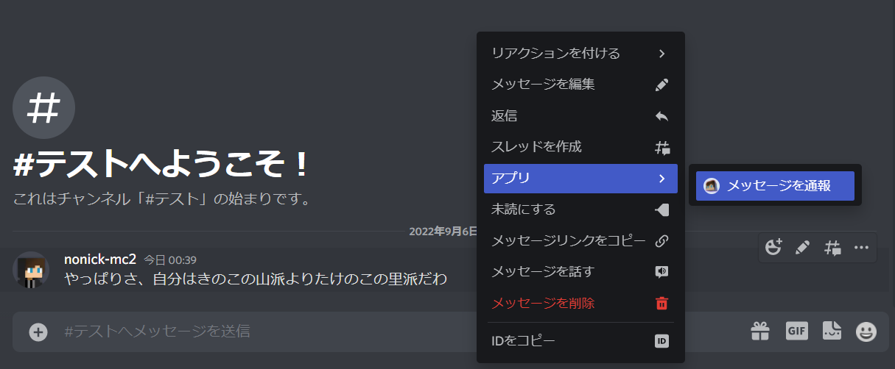
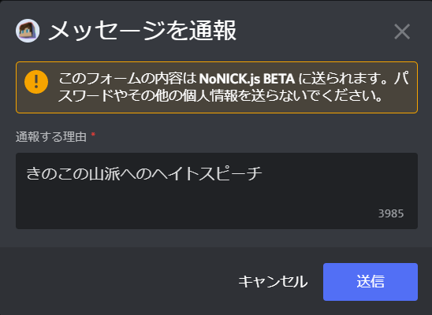
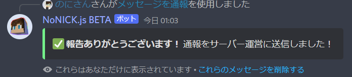
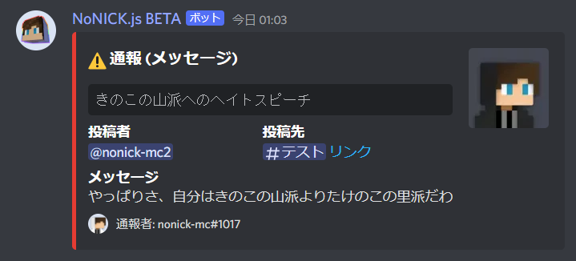

# 通報機能
通報機能を使用することで、サーバー内で投稿されたメッセージや参加しているメンバーをモデレーターチームに報告することができます。メッセージの監視をする必要がなくなるため、モデレーターチームの負担を**大幅に軽減させることができます。**

!!!danger
通報はサーバー内でのみ送信され、DiscordのTrust & Safetyに送信されることはありません。Discord公式への通報は[こちら](https://dis.gd/request)にアクセスしてください。
!!!

## 使い方
!!!
通報機能を使用できるようにするためには、**設定**にて`通報の送信先`を指定しておく必要があります。
!!!

### コンテキストメニューを開く
通報したいメッセージやユーザーのアイコンを右クリックして、`アプリ`→`メッセージ/ユーザーを通報`を選択します。(スマホ版の場合は長押し→`アプリ`→`メッセージ/ユーザーを通報`)

!!!warning
**以下の条件を満たすメンバーは通報できません。** 
・Webhookやシステムメッセージ 
・メッセージを管理 権限を持ったユーザー 
・自分自身やNoNICK.js自身
!!!

### モーダルに通報理由を記入する
`メッセージ/ユーザーを通報`コンテキストメニューを使用すると、このようなモーダルが表示されます。 
「通報する理由」に適切な理由を記入しましょう。

### 通報を送信する
先程入力したモーダルの「送信」ボタンを選択すると通報が送信され、送信成功を表す埋め込みが表示されます。(エラーが発生した場合は赤色の埋め込みが表示され、通報は送信されません。)

送られた通報は`通報の受取先`として設定されたチャンネルに埋め込みとして送信され、メッセージの発言者や通報理由と言った、通報に関する情報を閲覧することができます。

## 設定
=== 全般設定
通報機能を使用する上で基本となる設定です。

* 送信先  
送られた通報の送信先を設定します。NoNICK.jsがそのチャンネルに `チャンネルを見る` `メッセージを送信` `埋め込みを送信` の権限が全て付与されている必要があります。

=== ロールメンション
通報受け取り時にメンションするロールを設定することができます。モデレーターロール等を設定しておくことで、受け取った通報により素早く対応することができます。

* 有効化 / 無効化  
ロールメンション機能の状態を切り替えます。  

* ロール  
メンションするロールを設定します。(メンション通知を受け取る場合は、NoNICK.jsに `everyone、 @here、 すべてのロールにメンション` 権限が付与されている必要があります)
===
