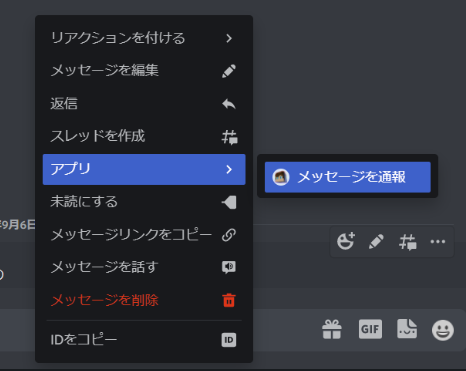

# 用語集
NoNICK.jsを使用する上で覚えておいて損はない用語をまとめています。

## スラッシュコマンド
「/」から始まる、BOTを操作するために必要なコマンドのことです。NoNICK.jsではこの**スラッシュコマンド**が採用されています。チャットボックスに「/」と入力することで、サーバーに導入されているBOTのコマンドの一覧を表示することができます。

!!!
DiscordBOTの中には**スラッシュコマンド**以外に、メッセージとしてコマンド名を直接入力する**テキストコマンド**を採用しているものがあります。  
!!!

## コンテキストメニュー
メッセージやメンバーを右クリック (スマホの場合は長押し) → 「アプリ」メニューで実行できる右クリックメニューのことです。NoNICK.jsではコンテキストメニューから「通報機能」や「メンバーの情報」等を使用することができます。

